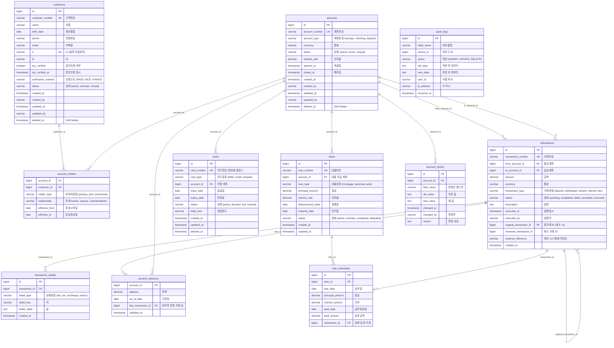

# 은행 시스템 ERD (Entity Relationship Diagram)

## 📊 전체 구조 다이어그램



---

## 🎯 핵심 관계 설명

### 1. customers ↔ accounts (N:M)
```
중간 테이블: account_holders

이유:
- 공동명의 계좌 (한 계좌에 여러 고객)
- 한 고객이 여러 계좌 보유
- 권한별 구분 (owner, joint, authorized)
```

**예시:**
```
고객 A + 고객 B → 공동 계좌 #100
고객 A → 개인 계좌 #200
고객 A (대표) + 고객 C (권한자) → 법인 계좌 #300
```

---

### 2. accounts → transactions (1:N)
```
한 계좌에 여러 거래

특징:
- from_account_id (출금)
- to_account_id (입금)
- 둘 다 있으면 이체
- 한쪽만 있으면 입출금
```

**예시:**
```
거래 #1: from=NULL, to=100 → 계좌 #100 입금
거래 #2: from=100, to=NULL → 계좌 #100 출금
거래 #3: from=100, to=200 → 계좌 #100→#200 이체
```

---

### 3. transactions → transactions (자기참조)
```
취소/정정 관계

original_transaction_id: 원래 거래
reversed_transaction_id: 취소 거래
```

**예시:**
```
거래 #100: A → B (10,000원)
거래 #101: B → A (10,000원) + original_transaction_id=100

→ 거래 #100 취소됨
```

---

### 4. accounts → account_balances (1:1)
```
잔액 캐시 (성능 최적화)

실제 잔액: transactions로 계산
캐시 잔액: 빠른 조회용

매일 밤 배치로 동기화
```

---

## 📋 테이블별 역할

### Tier 0 (최고 핵심)
| 테이블 | 역할 | 특징 |
|--------|------|------|
| **accounts** | 계좌 관리 | 돈의 그릇 |
| **transactions** | 거래 기록 | 진실의 원천 |

### Tier 1 (메인)
| 테이블 | 역할 | 특징 |
|--------|------|------|
| **customers** | 고객 정보 | 본인인증 필수 |

### Tier 2 (중요 지원)
| 테이블 | 역할 | 특징 |
|--------|------|------|
| **account_holders** | 계좌-고객 관계 | N:M 처리 |
| **cards** | 카드 관리 | 계좌 연결 |
| **loans** | 대출 관리 | 상환 스케줄 |

### Tier 3 (지원)
| 테이블 | 역할 | 특징 |
|--------|------|------|
| **account_balances** | 잔액 캐시 | 성능 최적화 |
| **transaction_details** | 거래 상세 | 추가 정보 |
| **loan_schedules** | 상환 스케줄 | 대출 세부 |

---

## 🔍 주요 쿼리 패턴

### 1. 계좌 잔액 조회
```sql
SELECT 
    a.account_number,
    COALESCE(SUM(
        CASE 
            WHEN t.to_account_id = a.id THEN t.amount
            WHEN t.from_account_id = a.id THEN -t.amount
        END
    ), 0) as balance
FROM accounts a
LEFT JOIN transactions t 
    ON (t.to_account_id = a.id OR t.from_account_id = a.id)
    AND t.status = 'completed'
WHERE a.id = ?
GROUP BY a.id, a.account_number;
```

### 2. 고객의 모든 계좌 조회
```sql
SELECT 
    c.name,
    a.account_number,
    ah.holder_type
FROM customers c
JOIN account_holders ah ON c.id = ah.customer_id
JOIN accounts a ON ah.account_id = a.id
WHERE c.id = ?
    AND ah.effective_to IS NULL  -- 현재 유효한 것만
    AND a.deleted_at IS NULL;
```

### 3. 거래 내역 (잔액 포함)
```sql
SELECT 
    t.transaction_number,
    t.executed_at,
    CASE 
        WHEN t.from_account_id = ? THEN '출금'
        WHEN t.to_account_id = ? THEN '입금'
    END as type,
    t.amount,
    SUM(
        CASE 
            WHEN t2.to_account_id = ? THEN t2.amount
            WHEN t2.from_account_id = ? THEN -t2.amount
        END
    ) OVER (ORDER BY t2.executed_at) as balance
FROM transactions t
LEFT JOIN transactions t2 
    ON t2.id <= t.id 
    AND t2.status = 'completed'
WHERE (t.from_account_id = ? OR t.to_account_id = ?)
    AND t.status = 'completed'
ORDER BY t.executed_at DESC;
```

---

## 🚨 설계 체크리스트

### 필수 확인사항:
- [ ] 모든 테이블에 created_at, updated_at
- [ ] 모든 테이블에 deleted_at (soft delete)
- [ ] 모든 금액 필드는 DECIMAL(15,2)
- [ ] transactions 테이블 절대 DELETE 금지
- [ ] 잔액은 직접 저장 금지 (계산으로 구함)
- [ ] 모든 거래는 DB 트랜잭션 내에서
- [ ] 취소는 역거래로 처리
- [ ] 감사 필드 (created_by, updated_by) 필수

---

## 💡 핵심 원칙

```
1. 절대 삭제 금지 → Soft Delete
2. 모든 변경 이력 보존 → 감사 추적
3. 잔액은 계산 → 거래가 진실
4. 관계는 분리 → N:M 대비
5. 확장성 < 정확성 → 보수적 설계
```


