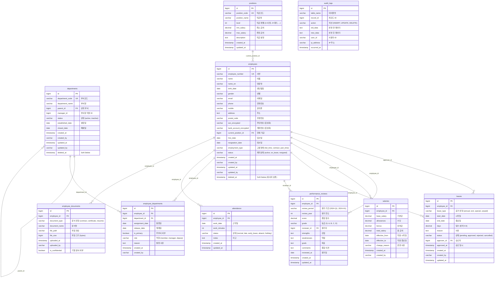

# 인사 관리 시스템 ERD (Entity Relationship Diagram)

## 📊 전체 구조 다이어그램



---

## 🎯 핵심 관계 설명

### 1. employees ↔ departments (N:M)
```
중간 테이블: employee_departments

이유:
- 부서 이동 이력 추적
- 겸직 가능 (주부서 + 겸직 부서)
- 시점별 소속 부서 관리
```

**예시:**
```
직원 A:
├─ 2024-01-01 ~ 2024-06-30: 개발팀
└─ 2024-07-01 ~ 현재: 기획팀 (부서 이동)

직원 B:
├─ 주부서: 개발팀
└─ 겸직: 품질관리팀
```

---

### 2. employees → salaries (1:N)
```
급여 변경 이력 추적

한 직원의 여러 급여 이력:
- 입사 시: 3,000,000원
- 1년 후: 3,500,000원 (인상)
- 2년 후: 4,000,000원 (인상)
```

---

### 3. departments → departments (Self Reference)
```
부서 계층 구조

예시:
본사
├─ 경영지원본부
│   ├─ 인사팀
│   └─ 재무팀
└─ 개발본부
    ├─ Backend팀
    └─ Frontend팀
```

---

### 4. employees → attendance (1:N)
```
일별 근태 기록

한 직원의 여러 출근 기록:
- 2024-10-01: 09:00 ~ 18:00
- 2024-10-02: 09:30 ~ 18:00 (지각)
- 2024-10-03: 휴가
```

---

## 📋 테이블별 역할

### Tier 0 (최고 핵심)
| 테이블 | 역할 | 특징 |
|--------|------|------|
| **employees** | 직원 정보 | 모든 것의 중심 |
| **departments** | 부서 정보 | 조직 구조 |

### Tier 1 (메인)
| 테이블 | 역할 | 특징 |
|--------|------|------|
| **positions** | 직급 체계 | 급여 범위 포함 |
| **salaries** | 급여 이력 | 변경 추적 |
| **employee_departments** | 소속 이력 | N:M 관계 |

### Tier 2 (지원)
| 테이블 | 역할 | 특징 |
|--------|------|------|
| **attendance** | 근태 기록 | 일별 출퇴근 |
| **leaves** | 휴가 관리 | 승인 프로세스 |
| **performance_reviews** | 성과평가 | 정기 평가 |

### Tier 3 (부가)
| 테이블 | 역할 | 특징 |
|--------|------|------|
| **employee_documents** | 문서 관리 | 파일 보관 |
| **audit_logs** | 감사 로그 | 변경 추적 |

---

## 🔍 주요 쿼리 패턴

### 1. 현재 소속 부서 조회
```sql
SELECT 
    e.name,
    d.department_name,
    ed.assignment_date
FROM employees e
JOIN employee_departments ed ON e.id = ed.employee_id
JOIN departments d ON ed.department_id = d.id
WHERE ed.release_date IS NULL  -- 현재 소속
    AND e.status = 'active';
```

### 2. 부서 조직도 (계층)
```sql
WITH RECURSIVE dept_tree AS (
    -- 루트 부서
    SELECT id, department_name, parent_id, 0 as level
    FROM departments
    WHERE parent_id IS NULL
    
    UNION ALL
    
    -- 하위 부서
    SELECT d.id, d.department_name, d.parent_id, dt.level + 1
    FROM departments d
    JOIN dept_tree dt ON d.parent_id = dt.id
)
SELECT * FROM dept_tree ORDER BY level, id;
```

### 3. 급여 이력
```sql
SELECT 
    e.name,
    s.base_salary,
    s.effective_from,
    s.change_reason
FROM employees e
JOIN salaries s ON e.id = s.employee_id
WHERE e.id = 1
ORDER BY s.effective_from DESC;
```

---

## 🚨 설계 체크리스트

### 필수 확인사항:
- [x] 모든 테이블에 created_at, updated_at
- [x] employees, departments에 deleted_at (soft delete)
- [x] 민감 정보 암호화 컬럼 (_encrypted 접미사)
- [x] 이력 테이블 (salaries, employee_departments)
- [x] 외래키 제약조건
- [x] 감사 필드 (created_by, updated_by)
- [x] 적절한 인덱스

---

## 💡 핵심 원칙

```
1. 이력 보존 → salaries, employee_departments
2. Soft Delete → employees, departments
3. 암호화 → ssn, bank_account
4. 감사 로그 → 모든 변경 추적
5. 계층 구조 → departments self-reference
```

---

## 🔗 관계 요약

```
employees (직원) ⭐⭐⭐
    ↓
├─ employee_departments → departments (부서)
├─ salaries (급여 이력)
├─ attendance (근태)
├─ leaves (휴가)
├─ performance_reviews (평가)
└─ employee_documents (문서)

departments (부서) ⭐⭐
    ↓ self-reference
departments (상위 부서)
```

---

**ERD는 `make erd-hr` 또는 `python update_erd.py hr` 명령으로 자동 생성됩니다.**

